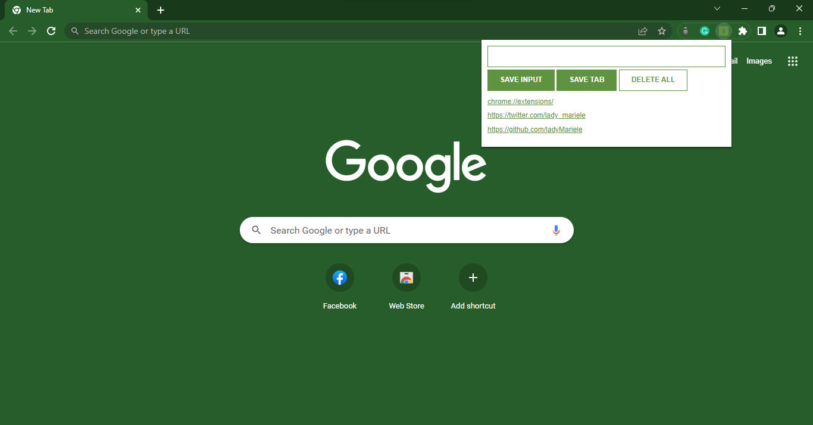

# Chrome Extension Leads Tracker - [Project on Scrimba](https://scrimba.com/learn/learnjavascript/) by [Per Harald Borgen](https://github.com/perborgen)

## what
this is a browser extension that lets you save tabs by pasting the URL in the input field, or by clicking a button to automatically save current tab.



## when do i use this extension
i'm a self taught developer and i use this extension to save tabs when i do my study/research on the web. i find it hard to navigate through my bookmarks. (seriously, does anyone here open their bookmarks?) You can use it this way but [Per Harald Borgen](https://github.com/perborgen) intentionally designed this as leads tracker.

## how u can use this extension in 5 easy steps
1. download this repo as [zip file](https://github.com/ladyMariele/chrome-extension/archive/refs/heads/main.zip)
2. unzip file
3. in Chrome or Brave browser, go to the extensions page (`chrome://extensions` or `brave://extensions`)
4. enable "Developer Mode"
5. drag the folder anywhere on the page to import it (do not delete the folder afterwards)

## and...
that's it! 🥳 this is my first time building a browser extension and [Per Harald Borgen](https://github.com/perborgen) made it so easy and explained things in a fun and interactive way. 🤓

Happy web browsing!

<!-- # cod9c432487b5108bdbfe13a0

Quick start:

```
$ npm install
$ npm start
````

Head over to https://vitejs.dev/ to learn more about using vite
## About Scrimba

At Scrimba our goal is to create the best possible coding school at the cost of a gym membership! 💜
If we succeed with this, it will give anyone who wants to become a software developer a realistic shot at succeeding, regardless of where they live and the size of their wallets 🎉
The Frontend Developer Career Path aims to teach you everything you need to become a Junior Developer, or you could take a deep-dive with one of our advanced courses 🚀

- [Our courses](https://scrimba.com/allcourses)
- [The Frontend Career Path](https://scrimba.com/learn/frontend)
- [Become a Scrimba Pro member](https://scrimba.com/pricing)

Happy Coding! -->
